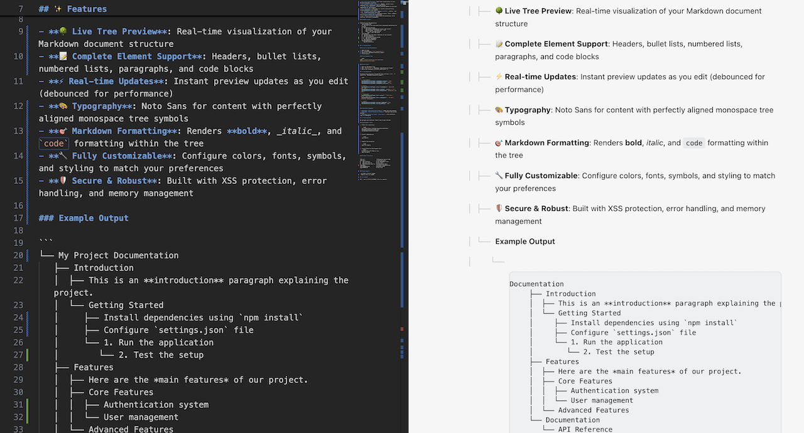

# Markdown Hierarchy Viewer

[](https://marketplace.visualstudio.com/items?itemName=your-publisher.markdown-hierarchy-viewer)
[](https://github.com/anton-g-kulikov/markdown-hierarchy-viewer)
[](https://opensource.org/licenses/MIT)

A VS Code extension that transforms your Markdown documents into beautiful, live hierarchical structures.


_Live tree visualization showing the structure of a Markdown document with real-time preview_

## ✨ Features

- **🌳 Live Tree Preview**: Real-time visualization of your Markdown document structure
- **📝 Complete Element Support**: Headers, bullet lists, numbered lists, paragraphs, and code blocks
- **⚡ Real-time Updates**: Instant preview updates as you edit (debounced for performance)
- **🎨 Typography**: Noto Sans for content with perfectly aligned monospace tree symbols
- **🎯 Markdown Formatting**: Renders **bold**, _italic_, and `code` formatting within the tree
- **🔧 Fully Customizable**: Configure colors, fonts, symbols, and styling to match your preferences
- **🛡️ Secure & Robust**: Built with XSS protection, error handling, and memory management

### Example Output

```
└── My Project Documentation
   ├── Introduction
   │  ├── This is an **introduction** paragraph explaining the project.
   │  └── Getting Started
   │     ├── Install dependencies using `npm install`
   │     ├── Configure `settings.json` file
   │     └── 1. Run the application
   │        └── 2. Test the setup
   ├── Features
   │  ├── Here are the *main features* of our project.
   │  ├── Core Features
   │  │  ├── Authentication system
   │  │  └── User management
   │  └── Advanced Features
   └── Documentation
      └── API Reference
```

## 📦 Installation

### From VS Code Marketplace

1. Open VS Code
2. Go to Extensions (`Ctrl/Cmd+Shift+X`)
3. Search for "Markdown Hierarchy Viewer"
4. Click Install

### From Command Line

```bash
code --install-extension your-publisher.markdown-hierarchy-viewer
```

### Quick Start

1. Open any Markdown file
2. Use `Cmd+Shift+P` → "Markdown: Show Hierarchy Viewer"
3. Watch your document structure come alive! 🎉

## ⚙️ Configuration

Customize the extension through VS Code settings (`Cmd+,` → search for "Markdown Hierarchy Viewer"):

```json
{
  // Tree symbols
  "markdownHierarchyViewer.treeSymbols.branch": "├──",
  "markdownHierarchyViewer.treeSymbols.last": "└──",
  "markdownHierarchyViewer.treeSymbols.vertical": "│",

  // Colors
  "markdownHierarchyViewer.colors.treeSymbols": "rgb(200, 200, 200)",
  "markdownHierarchyViewer.colors.content": "rgb(0, 0, 0)",
  "markdownHierarchyViewer.colors.background": "rgb(246, 246, 246)",

  // Typography
  "markdownHierarchyViewer.fonts.content": "'Noto Sans', Arial, sans-serif",
  "markdownHierarchyViewer.fonts.treeSymbols": "'SF Mono', Consolas, monospace",

  // Layout
  "markdownHierarchyViewer.styling.lineHeight": 1.6,
  "markdownHierarchyViewer.styling.padding": "4em"
}
```

### Available Commands

- **Markdown: Show Hierarchy Viewer** - Open the tree preview
- **Markdown: Refresh Hierarchy Viewer** - Refresh the current preview
- **Markdown Hierarchy Viewer: Show Logs** - View extension logs for debugging

## 🤝 Contributing

We welcome contributions! Here's how to get started:

### Development Setup

1. Clone this repository

   ```bash
   git clone https://github.com/anton-g-kulikov/markdown-hierarchy-viewer.git
   cd markdown-hierarchy-viewer
   ```

2. Install dependencies

   ```bash
   npm install
   ```

3. Compile the extension

   ```bash
   npm run compile
   ```

4. Launch Extension Development Host
   ```bash
   # Press F5 in VS Code or run:
   npm run watch
   ```

### Project Structure

```
├── src/                    # Extension source code
├── test/                   # Testing suite
│   ├── fixtures/          # Test Markdown files
│   ├── unit.test.ts       # Unit tests
│   └── extension.test.ts  # Integration tests
├── meta/                   # Project documentation
├── CHANGELOG.md           # Release notes
└── README.md              # This file
```

### Requirements

- VS Code 1.74.0 or higher
- Node.js 20.x or higher

## 📄 License

MIT - see the [MIT License](https://opensource.org/licenses/MIT) for details.
